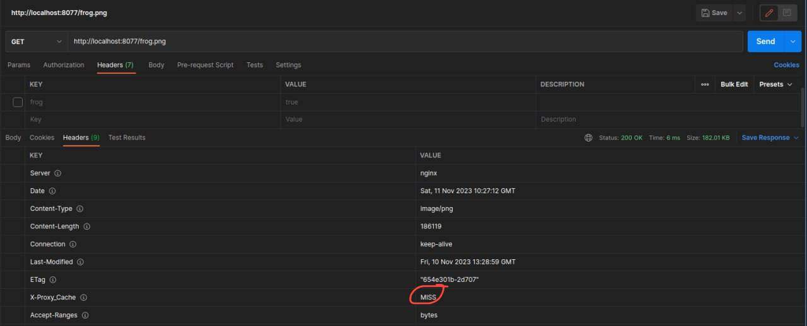
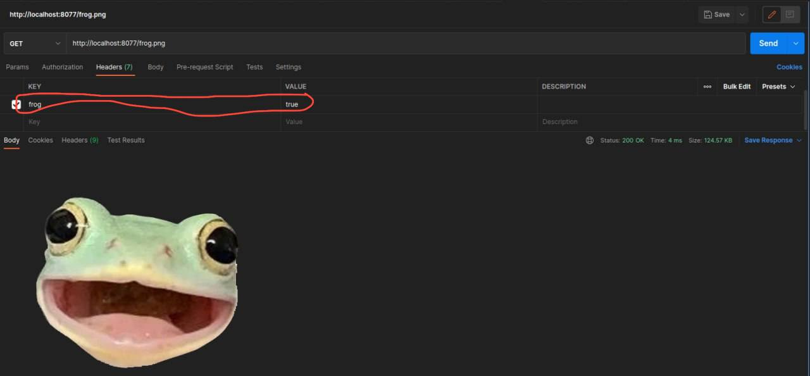

# Nginx Images Caching

## Run the nginx server

```bash
docker-compose up -d
```

### First Request: 

- Response: 

- Headers: 

### Second Request: 

- Response: 

- Headers: 

### Third Request(cache is working): 

- Response: 

- Headers: 

### Replacing the images: 

- With sh: 
```bash
    sh replace_images.sh
```

- With bash:

```bash
    bash replace_images.sh
```

### Fourth request(image not changed):

- Response: 

- Headers: 

### Fifth request(rewriting cache):

- Response: 

- Headers: 

### Sixth request(different photo in cache):

- Response: 

- Headers: 